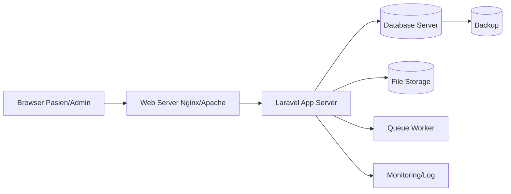

# Hardware Architecture

## Topologi

Client mengakses web server. Laravel menjalankan validasi, auth, checkout, laporan, dan upload. Database menyimpan transaksi/stok. Storage menyimpan gambar obat/resep. Queue worker memproses import dan laporan besar.

## Minimum Server

2 vCPU, RAM 2 GB, storage SSD 40 GB, bandwidth 20 Mbps.

## Rekomendasi

4 vCPU, RAM 8 GB, SSD 100 GB, backup harian, bandwidth 50 Mbps.

## Justifikasi

Beban 150-200 pasien/hari masih ringan, tetapi 2.000 obat dan laporan membutuhkan indexing, RAM cukup untuk cache/query, dan storage aman untuk gambar resep serta backup.
